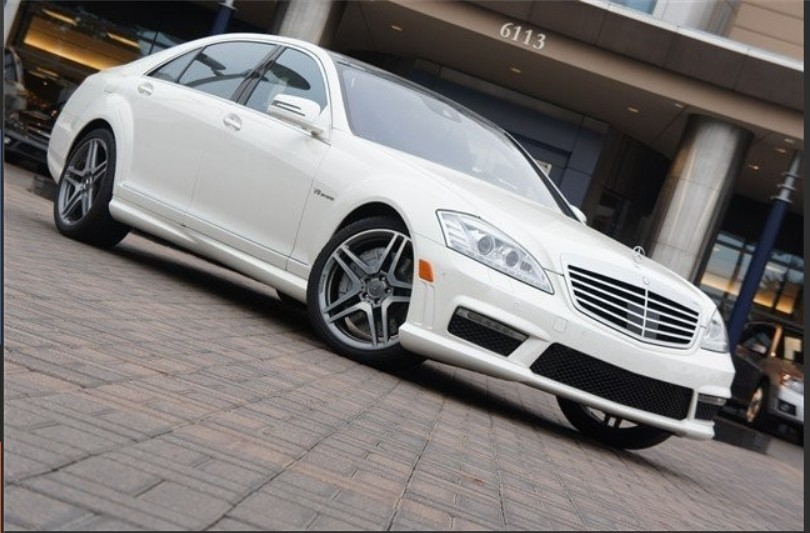

# Rebuilding_Image-Deep-Learning_Based_Image_Restoration
### 1. Giriş

Görüntü işleme; fotoğrafçılık, tıbbi görüntüleme, bilgisayarlı görme gibi pek çok alanda kritik öneme sahiptir. Ancak gerçek dünyadan elde edilen görüntüler çoğunlukla renk bozulmaları, eksik ya da hasarlı bölgeler ve düşük kaliteli sensörlerden ya da iletişim hatalarından kaynaklanan gürültüler içerir. Bu problemler, görüntü kalitesini düşürür ve sonraki analizlerin doğruluğunu etkiler.

Bu proje, görüntü restorasyonunda üç temel problemi çözmeyi hedefler:

- **Renklendirme (Colorization):** Siyah-beyaz veya gri tonlamalı görüntülere doğal ve gerçekçi renkler eklenmesi.

- **Onarma (Inpainting):** Kayıp veya hasar görmüş bölgelerin çevresindeki yapıyı dikkate alarak doldurulması.

- **Gürültü Giderme (Denoising):** Görüntülerdeki istenmeyen parazitlerin azaltılması veya kaldırılması.

Derin öğrenme teknikleri kullanarak bu problemlere etkin çözümler sunmak ve görüntü kalitesini artırmak amaçlanmaktadır.

---

### 2. Temel Bilgiler

#### 2.1 Derin Öğrenme ve Görüntü İşlemedeki Kullanımı

Derin öğrenme, çok katmanlı yapay sinir ağları kullanarak karmaşık veri yapılarından anlamlı desenler öğrenmeyi sağlar. Görüntü işleme alanında, özellikle Evrişimli Sinir Ağları (CNN), geleneksel yöntemlere kıyasla çok daha esnek ve güçlü çözümler sunar. Bu sayede birçok görüntü işleme problemi, otomatik ve başarılı şekilde çözülebilmektedir.

#### 2.2 GAN (Generative Adversarial Networks) Nedir?

GAN, iki sinir ağının birbirine karşı yarıştığı bir mimaridir:

- **Generator (Üretici):** Girdi verisinden olabildiğince gerçekçi yeni veriler üretmeye çalışır.

- **Discriminator (Ayırt Edici):** Üretilen verinin gerçek mi yoksa sahte mi olduğunu tahmin etmeye çalışır.

Bu yarışma süreci sayesinde generator, giderek daha gerçekçi veriler üretmeyi öğrenir.

#### 2.3 Colorization, Inpainting ve Denoising Problemleri

- **Colorization:** Siyah-beyaz veya gri tonlamalı görüntülere renk ekleme işlemi. Eski fotoğrafların restorasyonu ve görsel zenginlik için önemlidir.

- **Inpainting:** Eksik veya hasarlı bölgelerin çevre yapıya uyumlu şekilde doldurulmasıdır. Eski eser restorasyonu, istenmeyen nesnelerin kaldırılması gibi uygulamalarda kullanılır.

- **Denoising:** Görüntülerdeki parazitlerin temizlenerek netliğin artırılmasıdır.

Bu işlemler, görüntü kalitesini ve görsel algıyı iyileştirir.

#### 2.4 PatchGAN

PatchGAN, geleneksel GAN discriminatorlarından farklı olarak, görüntüyü parçalara (patch) bölerek her bir bölgeyi ayrı ayrı değerlendirir. Böylece daha yerel ve detaylı kararlar alınabilir.

**Çalışma Prensibi:**

- Konvolüsyonel katmanlarla giriş görüntüsü işlenir.

- NxN boyutunda çıktı haritası oluşturulur (ör. 30x30).

- Her patch için gerçeklik değeri tahmin edilir.

---

### 3. Yöntem / Methodology

#### 3.1 Image Inpainting Mimarisi

**Generator (Üretici Ağ):**  
Dikkat mekanizmaları içeren iki aşamalı (coarse-to-fine) yapı:

- **Kaba Aşama:** 16 katmanlı gated konvolüsyon ağı, dilasyon oranları ve transposed conv ile özellik çıkarımı ve boyut artırımı.

- **İnce Aşama:** 9 katmanlı iyileştirme ağı, self-attention ile detayların geliştirilmesi.

**Discriminator (Ayırt Edici Ağ):**  
Spektral normalizasyonlu PatchGAN yapısı:

- 7 katmanlı konvolüsyonel ağ

- Spectral normalization ve LeakyReLU aktivasyonu

- Eğitim sırasında noise injection uygulanır

---

#### 3.2 Özel Katmanlar

- **SpectralConv2d:** Spektral normalizasyon uygulayarak ağırlıkların stabilitesini sağlar.

- **GatedConv2d:** Maskelenmiş görüntülerde hangi bölgenin önemli olduğunu belirlemek için gating mekanizması uygular.

- **GatedUpConv2d:** Up-sampling ve gated convolution’u birleştirir.

- **SelfAttention:** Uzun menzilli pikseller arası ilişkileri öğrenerek içerik tamamlama kalitesini artırır.

---

## 3.3 Inpainting Modelinin Genel Çalışma Prensibi

Inpainting modeli, eksik veya hasarlı görüntü bölgelerini, çevresel bağlama uygun şekilde yeniden oluşturmayı hedefler. Bu işlem, **Generative Adversarial Network (GAN)** mimarisiyle gerçekleştirilmiştir.

#### 🔹 Giriş Verisi
- **Generator**, **4 kanallı bir girdi** alır:
  - İlk 3 kanal: Maskelenmiş RGB görüntü (`R, G, B`)
  - 4. kanal: Maskeyi temsil eden ikili harita (0 = eksik, 1 = sağlam)=>Maske siyah ile temsil edilmiştir.
- Bu giriş sayesinde model, hem görüntü içeriğini hem de eksik bölgeleri aynı anda analiz edebilir.

#### 🔹 Generator (Üretici Ağ)
- Girdi olarak verilen 4 kanallı veriden, **3 kanallı tamamlanmış bir RGB görüntü** üretir.
- **İki aşamalı yapı** kullanılır:
  - **Kaba Aşama (Coarse Stage):** Görüntünün genel yapısını ve içeriğini üretir.
  - **İnce Aşama (Refinement Stage):** Self-attention mekanizmaları ile detayları geliştirir, daha net ve doğal bir sonuç üretir.

#### 🔹 Discriminator (Ayırt Edici Ağ)
- Üretilen görüntüyü değerlendirmek için **PatchGAN** tabanlı discriminator kullanılır.
- Bu yapı, yalnızca tüm görüntüyü değil, aynı zamanda **yerel (patch bazlı) detayları** da analiz eder.
- Gerçek ve üretilmiş görüntüler arasındaki farkı öğrenmeye çalışır.

#### 🔹 Adversarial Eğitim Süreci
- **Generator**, maskelenmiş görüntüden eksik bölgeleri tamamlamayı öğrenir.
- **Discriminator**, gerçek ve üretilmiş görüntüleri ayırt etmeyi öğrenir.
- Bu süreç birbirine karşı yarışan iki ağdan oluşur; böylece generator zamanla daha **gerçekçi ve tutarlı** çıktılar üretmeyi başarır.

#### ✅ Sonuç
Bu mimari sayesinde model:
- Görüntülerdeki eksik alanları **bağlama uygun biçimde** tamamlar.
- **Orta boyutlu maskeler** için başarılı ve görsel olarak tatmin edici çıktılar üretir.
- Detayların korunması ve içerik bütünlüğü açısından güçlü bir çözümdür.

#### 3.3 Image Colorization Mimarisi

GAN tabanlı renk ekleme sistemi:

- **Generator:** UNet tabanlı, encoder-decoder mimarisi, 8 encoder + 7 decoder katmanı, skip bağlantılar ile detay koruma.

- **Discriminator:** 4 katmanlı PatchGAN, 70x70 piksellik patchler üzerinden gerçeklik değerlendirmesi.

**Kayıp Fonksiyonları:**

- Adversarial loss (gan loss)

- L1 kaybı (renk doğruluğu için) – ağırlıklı (λ=100)=Modelin öğrenmesine göre arttırılıp azaltılabilir.

**Eğitim Süreci:**

- Optimizasyon: Adam optimizer (lr=1e-4)

- Öğrenme Oranı Çizelgesi: 30 epoch'ta bir 10 kat azalma

- Eğitim Stratejisi:

  - Ayırt edici ağ güncellenir

  - Üretici ağ güncellenir

  - Bu döngü tekrarlanır

Bu sistem, geleneksel UNet mimarisini GAN çerçevesiyle birleştirerek hem yapısal hem de görsel kaliteyi koruyan renklendirme sonuçları üretmektedir. Skip bağlantıları sayesinde ince detayların korunması sağlanırken, PatchGAN tabanlı ayırt edici ağ görüntülerin doğal görünümünü garanti altına almaktadır.

### 3.4 Image Colorization Modelinin Genel Çalışma Prensibi

Bu sistem, **siyah-beyaz (gri tonlamalı)** görüntüleri otomatik olarak renklendirmek amacıyla **Conditional GAN** mimarisi ile eğitilmiştir. Model, görüntüleri **CIE LAB renk uzayında** işler.

#### 🔹 LAB Renk Uzayı
- Görüntü, LAB renk uzayına dönüştürülür:
  - **L kanalı:** Görüntünün parlaklık (luminance) bilgisi – giriş olarak kullanılır.
  - **a ve b kanalları:** Renk bileşenleri – modelin tahmin etmeye çalıştığı hedef değerlerdir.

#### 🔹 Conditional GAN Mimarisi
- **Generator**:
  - Girdi olarak yalnızca `L` kanalı alır (1 kanallı gri tonlamalı görüntü).
  - `a` ve `b` kanallarını tahmin eder (çıktı: 2 kanallı).
  - Elde edilen `L + ab` birleşimi, LAB'den RGB renk uzayına çevrilerek **renklendirilmiş görüntü** elde edilir.
  - UNet tabanlı encoder-decoder mimarisi kullanılır, skip bağlantılar ile detay korunur.

- **Discriminator**:
  - Hem `L` kanalı (giriş) hem de `ab` (üretim/gerçek) kanalları birlikte değerlendirilir.
  - PatchGAN yapısı kullanılarak yerel renk uyumları ve gerçeklik denetlenir.

#### 🔹 Eğitim Süreci
- **Giriş:** L kanalı (gri görüntü)
- **Hedef:** a ve b kanalları (renk bilgisi)
- **Kayıp Fonksiyonları:**
  - **Adversarial Loss:** Üretilen renklendirmelerin gerçekliğini değerlendirmek için.
  - **L1 Loss:** Tahmin edilen `ab` kanalları ile gerçek `ab` kanalları arasındaki farkı minimize etmek için.
  - L1 kaybı genellikle daha ağır basar (λ=75 gibi).

#### 🔁 Uygulama Akışı
1. Giriş RGB görüntü LAB formatına dönüştürülür.
2. `L` kanalı modele verilir.
3. Model `a` ve `b` kanallarını üretir.
4. `L`, `a`, `b` birleştirilir.
5. LAB uzayından tekrar RGB’ye dönüştürülerek renklendirilmiş görüntü elde edilir.

#### ✅ Sonuç
Bu yaklaşım sayesinde:
- Siyah-beyaz görüntüler anlamlı ve doğal renklerle renklendirilir.
- LAB renk uzayı sayesinde model yalnızca renkleri öğrenmeye odaklanır, parlaklık bilgisi sabit kalır.
- Conditional GAN yapısı sayesinde girişe özel daha iyi renklendirme uyumu sağlanır.

### Denoising Model Mimarileri Analizi

Bu kodda bir denoising (gürültü giderme) görevi için iki ana sinir ağı mimarisi sunulmuştur: bir generator (UNetGenerator) ve bir discriminator (PatchDiscriminator). Bu tür mimariler genellikle GAN (Generative Adversarial Network) veya denoising autoencoder sistemlerinde kullanılır.

**Generator Mimarisi (UNetGenerator):**

- Encoder Kısmı: 7 katmanlı ConvBlock'dan oluşur  
- Her katmanda özellik haritası boyutu yarıya iner (stride=2)  
- Özellik kanal sayısı katlanarak artar (64, 128, 256, 512, ...)  
- Batch normalization ve ReLU aktivasyonu uygulanır  

**Bottleneck Katmanı:**

- Encoder'dan gelen özellikleri genişletir (transpose convolution)  
- Bilgi akışını decoder'a hazırlar  

**Decoder Kısmı:**

- 6 katmanlı ConvBlock'dan oluşur  
- Her katmanda özellik haritası boyutu ikiye katlanır  
- Skip connections ile encoder'dan gelen bilgiler birleştirilir (detay koruma)  

**Final Katman:**

- Giriş görüntüsü ile son decoder çıktısını birleştirir  
- Tanh aktivasyonu ile [-1, 1] aralığında çıktı verir  

**Avantajları:**

- Skip connections sayesinde hem yüksek seviye hem de düşük seviye özellikler korunur  
- Derin mimarisi sayesinde karmaşık gürültü modellerini öğrenebilir  
- Giriş ve çıkış boyutları aynı kalır (örneğin 256x256)  

---

**Discriminator Mimarisi (PatchDiscriminator):**

- 4 temel konvolüsyon katmanından oluşur  
- Her katmanda özellik haritası boyutu yarıya iner  
- Özellik kanalları artar (64, 128, 256, 512)  
- LeakyReLU aktivasyonu kullanılır  
- Batch normalization uygulanır (ilk katman hariç)  
- Son katmanda 1x1 boyutunda çıktı üretir (patch tabanlı)  

**Avantajları:**

- Yerel (patch) düzeyinde değerlendirme yaparak daha detaylı feedback sağlar  
- Daha az parametre ile etkili öğrenme sağlar  
- GAN eğitiminde daha stabil sonuçlar verir  

---

### Genel Sistem Çalışması

Bu model, GAN tabanlı bir UNet kullanarak gürültülü görüntüleri temizler. İşleyiş:

**Generator (UNet)**

- Girdi: 3 kanallı (RGB) gürültülü görüntü.
- Encoder: 7 katmanla özellik çıkarımı yapar.
- Decoder: Skip connections ile detayları koruyarak temiz görüntü oluşturur.
- Çıktı: [-1, 1] aralığında normalize edilmiş temizlenmiş görüntü.

**Discriminator (PatchGAN)**

- Görev: Generator çıktısı ile gerçek temiz görüntüyü ayırt eder.
- Mimari: 4 konvolüsyon katmanı (64→512 filtre).
- Çıktı: 30x30 boyutunda "gerçek/sahte" puan matrisi.

**Kayıp Fonksiyonları**

- Content Loss (L1): Piksel bazlı hata.
- Adversarial Loss: Discriminator'ü kandırma.
- Perceptual Loss (VGG16): Yapısal benzerlik.

** Eğitim Süreci **

- Discriminator: Gerçek ve sahte görüntüleri ayırt eder.
- Generator: Hem gürültüyü temizler hem de Discriminator'ü kandırmayı öğrenir.
- EMA: Model kararlılığını artırır.

#### ✅ Sonuç

- Yüksek PSNR/SSIM değerleri.
- Gaussian, tuz-biber, speckle gürültülerine karşı etkili temizleme.
- Gerçekçi ve detay koruyan çıktılar.
- Örnek:
- [Gürültülü] → [Generator Çıktısı] → [Gerçek Temiz] şeklinde görselleştirme yapılabilir.

Bu tür mimariler özellikle görüntü restorasyonu, denoising ve image-to-image translation görevlerinde başarılı sonuçlar vermektedir.

---

### 6. Dataset / Veri Seti

Bu projede üç farklı görev (Colorization, Inpainting, Denoising) için çeşitli veri setleri ve özel ön işleme adımları uygulanmıştır.

**Colorization**

- Renklendirme görevinde kullanılan veri seti, RGB formatındaki görüntülerden oluşmaktadır. Modelin daha iyi renk öğrenmesi için bu görüntüler CIE LAB renk uzayına dönüştürülmüştür. Aşağıdaki adımlar izlenmiştir:

- RGB görüntüler LAB renk uzayına çevrildi.

- Görüntüler, L (aydınlık) ve ab (renk) kanallarına ayrıldı.

- L kanalı modelin girdisi olarak kullanıldı.

- a ve b kanalları tahmin edilmesi gereken hedef olarak kullanıldı.

- Görüntüler normalize edildi (örn. L kanalı [0, 1] aralığına).

- Görüntüler sabit boyuta (örn. 256x256) yeniden boyutlandırıldı.

- Veri artırma (augmentation) teknikleri uygulandı: kırpma, çevirme vb.

- Model çıktısı olarak elde edilen ab kanalları, giriş L kanalı ile birleştirilip RGB'ye dönüştürüldü.

**Inpainting**

- Görüntü tamamlama görevinde modelin hasarlı bölgeleri doldurmayı öğrenebilmesi için her bir eğitim örneğine özel dinamik ve rastgele maskeler uygulanmıştır:

- Her eğitim iterasyonunda farklı bir rastgele maske oluşturuldu.

- Maskeler 1 (boş/hasarlı) ve 0 (sağlam) değerlerinden oluşan binary matrislerdir.

- Orijinal görüntü maskelenerek giriş verisi oluşturuldu:
Input = [Masked_Image, Mask] → 4 kanallı giriş

- Görüntüler normalize edilerek [-1, 1] aralığına getirildi.

- Görüntüler sabit boyuta yeniden boyutlandırıldı.

-Model, maskeli alanları çevredeki piksellere göre tamamlamayı öğrendi.

**Denoising**

- Gürültü giderme görevinde, modelin gürültülü görüntülerden temiz görüntüleri yeniden üretmeyi öğrenmesi hedeflendi.

- Orijinal temiz görüntülerden bir veri seti oluşturuldu.

- Veri setindeki yüksek çözünürlüklü görüntülerden, rastgele konumlarda 256x256 boyutlarında parçalara (patch) ayrılarak eğitim örnekleri elde edildi.

- Her 256x256’lık patch’e eğitim sırasında farklı seviyelerde sentetik gürültü (örneğin Gauss gürültüsü) eklendi.

- Modelin girişi: Gürültülü patch
- Modelin hedef çıktısı: Karşılık gelen temiz patch

- Tüm görüntüler eğitimden önce normalize edildi (-1,1).

- İsteğe bağlı olarak veri artırma (data augmentation) yöntemleri uygulandı (çevirme, döndürme, parlaklık değişimi vb.).

---

### 7. Training Details / Eğitim Detayları

### 8. Loss Fonksiyonları Karşılaştırma Tablosu

| Loss Fonksiyonu              | Inpainting | Colorization | Denoising | Açıklama                                                                               |
| ---------------------------- | :--------: | :----------: | :-------: | -------------------------------------------------------------------------------------- |
| **Adversarial Loss (GAN)**   |     ✔️     |      ✔️      |     ✔️    | Üretilen görüntünün gerçekçiliğini ayırt ediciye karşı artırmak için kullanılır.       |
| **L1 Loss / Content Loss**   |     ✔️     |      ✔️      |     ✔️    | Üretilen ve gerçek görüntüler arasındaki piksellerin mutlak farkını minimize eder.     |
| **Reconstruction Loss**      |     ✔️     |       ❌      |     ❌     | Eksik bölgelerin gerçek görüntü ile yeniden yapılandırılmasını sağlar.                 |
| **Perceptual Loss (VGG)**    |     ✔️     |       ❌      |     ✔️    | Görüntülerin özellik uzayında benzerliğini ölçerek algısal kaliteyi artırır.           |
| **Style Loss (Gram Matrix)** |     ✔️     |       ❌      |     ❌     | Görüntülerin stil (doku, renk dağılımı) uyumunu sağlayan gram matrisine dayalı kayıp.  |
| **Total Variation Loss**     |     ✔️     |       ❌      |     ❌     | Görüntüdeki gürültü ve keskin değişimleri azaltarak pürüzsüzlük sağlar.                |
| **BCEWithLogits / BCE Loss** |     ✔️     |      ✔️      |     ✔️    | Gerçek/sahte sınıflandırma için kullanılan binary cross entropy kaybı.                 |
| **MSE Loss (Alternatif)**    |      ❌     |       ❌      | ✔️ (ops.) | Ortalama kare hata, özellikle alternatif içerik veya görüntü farkları için kullanılır. |

## 8. Results / Sonuçlar

### 8.1 Gürültü Giderme (Gaussian Noise)

  
  

  <b>Solda:</b> Orijinal Görüntü | <b>Sağda:</b> Gürültülü Girdi

  
  

  <b>Solda:</b> İlk Epoch Çıktısı | <b>Sağda:</b> Son Epoch Çıktısı

---

### 8.2 Gürültü Giderme (Salt & Pepper Noise)

  
  

  <b>Solda:</b> Orijinal Görüntü | <b>Sağda:</b> Tuz & Biber Gürültülü Girdi

  
  

  <b>Solda:</b> İlk Epoch Çıktısı | <b>Sağda:</b> Son Epoch Çıktısı

---

### 8.3 Gürültü Giderme (Başka Bir Örnek)

  
  

  <b>Solda:</b> Orijinal Görüntü | <b>Sağda:</b> Gürültülü Girdi

  
  

  <b>Solda:</b> İlk Epoch Çıktısı | <b>Sağda:</b> Son Epoch Çıktısı

---

## 9. Inpainting Sonuçları

### 9.1 Inpainting Örneği 1

  

  <b>Orijinal (maskelenmiş) Görüntü</b>

  

  <b>İlk Epoch Çıktısı</b>

  

  <b>Son Epoch Çıktısı</b>

---

### 9.2 Inpainting Örneği 2

  

  <b>Orijinal (maskelenmiş) Görüntü</b>

  

  <b>İlk Epoch Çıktısı</b>

  

  <b>Son Epoch Çıktısı</b>

---

## 10. Colorization – Gri Tonlama Görüntüler

  
  
  

  <b>Modelin renklendirme yaptığı orijinal renkli giriş görüntüleri</b>

---

## 11. Colorization – Epoch Karşılaştırmaları

### 11.1 Example 1

  

  <b>İlk Epoch Çıktısı</b>

  

  <b>Son Epoch Çıktısı</b>

---

### 11.2 Example 2

  

  <b>İlk Epoch Çıktısı</b>

  

  <b>Son Epoch Çıktısı</b>

---

### 11.3 Example 3

  

  <b>İlk Epoch Çıktısı</b>

  

  <b>Son Epoch Çıktısı</b>

### 10. Discussion / Tartışma

#### Modelin Güçlü ve Zayıf Yönleri

**Inpainting Modeli:**  
- **Güçlü Yönler:** Model, orta büyüklükteki maskelenmiş (hasarlı) bölgelerde oldukça başarılı ve tutarlı sonuçlar üretmektedir. Çevresel yapıyı iyi analiz ederek, eksik alanları doğal şekilde tamamlayabilmektedir.  
- **Zayıf Yönler:** Çok büyük ve kapsamlı maskeler uygulandığında, model bazen tutarsız veya gerçekçilikten uzak sonuçlar verebilmektedir. Bu durum özellikle karmaşık yapılar veya detaylı dokuların olduğu bölgelerde daha belirgindir.

**Colorization Modeli:**  
- **Güçlü Yönler:** Genel olarak renk tonları ve uyumu açısından başarılı ve doğal renklendirmeler yapmaktadır. Büyük ve basit objelerde gerçekçi renk geçişleri sağlamaktadır.  
- **Zayıf Yönler:** Çok detaylı ve karmaşık renk dağılımı gerektiren bölgelerde, model bazen renk uyumsuzlukları veya eksiklikleri gösterebilmektedir. İnce detaylarda renklendirme performansı sınırlı kalabilmektedir.

#### Eğitim Sürecinde Karşılaşılan Zorluklar ve Çözümler

Projede GAN mimarisi kullanılması sebebiyle eğitim sırasında çeşitli zorluklarla karşılaşıldı. Özellikle **discriminator** ağının, **generator** ağını "ezmesi" (discriminatorun çok hızlı ve baskın öğrenerek generatorun öğrenmesini engellemesi) önemli bir sorun olarak belirdi. Bu durum, modelin dengeli şekilde eğitilmesini zorlaştırdı ve sonuçların istikrarsız olmasına yol açtı.

Bu zorluklarla başa çıkmak için aşağıdaki yöntemler uygulandı:

- **Label Smoothing (Etiket Yumuşatma):** Discriminator eğitiminde gerçek/sahte etiketlere küçük rastgele değerler eklenerek ağın aşırı kesin karar vermesi engellendi. Bu sayede discriminatorun aşırı baskın olması yumuşatıldı.  
- **Discriminator’a Gürültü Enjeksiyonu (Noise Injection):** Eğitim sırasında discriminatorun girişine düşük oranlarda rastgele gürültü eklenerek, aşırı ezici kararlar vermesi engellendi ve modelin genelleme kapasitesi artırıldı.  
- **Learning Rate Scheduler Kullanımı:** Hem generator hem de discriminator için öğrenme oranları dinamik olarak ayarlanarak, özellikle eğitim ilerledikçe öğrenme oranlarının düşürülmesi sağlandı. Böylece ani dalgalanmaların önüne geçildi.  
- **Mimari Deneyler ve Değişiklikler:** Farklı mimari yapılar ve katman sayıları denenerek daha dengeli bir eğitim süreci hedeflendi. Özellikle discriminatorun kapasitesi optimize edilerek, generatorun öğrenme şansı artırıldı.  
- **Eğitim Döngüsünde Dengeleme:** Discriminator ve generatorun güncellenme sıklıkları dengelendi; bazı durumlarda discriminatorun aşırı eğitilmesini engellemek için güncelleme sıklığı azaltıldı.

Bu yöntemlerin uygulanması sonucunda, GAN modelinin stabilitesi önemli ölçüde artırıldı ve daha kaliteli, tutarlı sonuçlar elde edildi. Projenin başarısı için bu dengeyi sağlamak ve en uygun hiperparametre ile mimariyi belirlemek kritik oldu.

### 🎨 11.Uygulama Arayüzleri

#### Ana Arayüz

---

#### 📷 Colorization (Renklendirme)

---

#### 🧩 Inpainting (Görüntü Onarma)

---

#### 🧹 Denoising (Gürültü Giderme)

